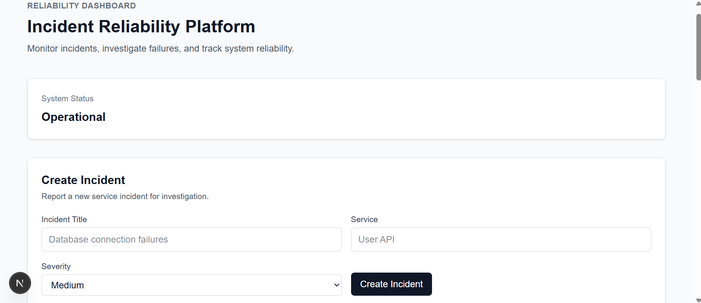

# Incident Reliability Platform

A full-stack incident management and reliability platform for tracking service incidents from creation through investigation and resolution.

The application provides persistent incident tracking, lifecycle event history, operational metrics such as Mean Time to Resolution (MTTR), and a tested REST API backed by PostgreSQL.

## Dashboard



## Overview

The Incident Reliability Platform models a simplified production incident-management workflow.

Users can:

- Report service incidents with severity levels.
- Track incidents through OPEN, INVESTIGATING, and RESOLVED states.
- View a chronological lifecycle history for each incident.
- Monitor active and critical incidents from a dashboard.
- Measure Mean Time to Resolution (MTTR).
- Persist incident and event data in PostgreSQL.

The project emphasizes backend architecture, data integrity, testing, and reproducible development rather than relying only on frontend state.

## Features

### Incident Management

Create incidents containing:

- Title
- Affected service
- Severity

Supported severity levels:

- LOW
- MEDIUM
- HIGH
- CRITICAL

Incidents progress through the lifecycle:

```text
OPEN
  ↓
INVESTIGATING
  ↓
RESOLVED
```

### Incident Lifecycle History

Each incident maintains an event history stored separately from the current incident state.

Supported lifecycle events include:

```text
CREATED
INVESTIGATION_STARTED
RESOLVED
```

This allows the application to preserve what happened during an incident rather than storing only its latest status.

### Reliability Metrics

The dashboard displays:

- Total Incidents
- Active Incidents
- Critical Incidents
- Mean Time to Resolution (MTTR)

MTTR is calculated from persisted lifecycle timestamps in PostgreSQL.

For each resolved incident:

```text
Resolution Time = RESOLVED timestamp - CREATED timestamp
```

The platform then averages the resolution times of resolved incidents.

### Data Validation

Incoming API requests are validated before database operations are performed.

The PostgreSQL schema also enforces data integrity through:

- NOT NULL constraints
- Severity CHECK constraints
- Status CHECK constraints
- Event type CHECK constraints
- Foreign-key relationships
- Cascading lifecycle-event deletion

This provides validation at both the application and database layers.

## Architecture

The application uses a layered architecture:

```text
React / Next.js Dashboard
          │
          ▼
     REST API Routes
          │
          ▼
   Validation Layer
          │
          ▼
   Repository Layer
          │
          ▼
      PostgreSQL
     ┌────┴─────┐
     ▼          ▼
 incidents   incident_events
```

Responsibilities are separated so that UI components do not communicate directly with the database.

### Incident Lifecycle

```text
Create Incident
      │
      ▼
POST /api/incidents
      │
      ▼
Database Transaction
      ├── Create incident
      └── Record CREATED event

OPEN
      │
      ▼
Start Investigation
      │
      ▼
PATCH /api/incidents/[id]
      │
      ├── Update status
      └── Record INVESTIGATION_STARTED event

INVESTIGATING
      │
      ▼
Resolve Incident
      │
      ▼
PATCH /api/incidents/[id]
      │
      ├── Update status
      └── Record RESOLVED event

RESOLVED
```

Incident state changes and their corresponding lifecycle events are persisted together so the current state and event history remain consistent.

## Technology Stack

### Frontend

- React
- Next.js
- TypeScript
- Tailwind CSS

### Backend

- Next.js Route Handlers
- Node.js
- TypeScript

### Database

- PostgreSQL
- `pg` PostgreSQL client

### Testing and Quality

- Vitest
- Unit tests
- Repository integration tests
- API integration tests
- ESLint
- TypeScript
- GitHub Actions CI

## Database Design

### `incidents`

Stores the current state of each incident.

| Column | Description |
| --- | --- |
| `id` | Auto-generated incident identifier |
| `title` | Incident description |
| `service` | Affected service |
| `severity` | LOW, MEDIUM, HIGH, or CRITICAL |
| `status` | OPEN, INVESTIGATING, or RESOLVED |
| `created_at` | Incident creation timestamp |

Application responses format numeric database IDs as values such as:

```text
INC-001
INC-002
INC-003
```

### `incident_events`

Stores the historical lifecycle of incidents.

| Column | Description |
| --- | --- |
| `id` | Auto-generated event identifier |
| `incident_id` | Foreign key referencing the incident |
| `event_type` | Lifecycle event |
| `created_at` | Time the event occurred |

The relationship is:

```text
incidents
    │
    │ one-to-many
    ▼
incident_events
```

Deleting an incident cascades to its associated lifecycle events.

An index on `incident_events.incident_id` supports efficient history lookups.

## API

### Get all incidents

```http
GET /api/incidents
```

Returns all persisted incidents.

### Create an incident

```http
POST /api/incidents
Content-Type: application/json
```

Example request:

```json
{
  "title": "Payment processor timeout",
  "service": "Payment API",
  "severity": "CRITICAL"
}
```

### Get an incident

```http
GET /api/incidents/[id]
```

Example:

```text
GET /api/incidents/INC-001
```

### Update incident status

```http
PATCH /api/incidents/[id]
Content-Type: application/json
```

Example:

```json
{
  "status": "INVESTIGATING"
}
```

### Get incident history

```http
GET /api/incidents/[id]/events
```

Returns the chronological lifecycle events associated with the incident.

### Get reliability metrics

```http
GET /api/metrics
```

Returns reliability metrics derived from persisted lifecycle data, including resolved incident count and MTTR.

## Local Development

### Prerequisites

Install:

- Node.js
- npm
- PostgreSQL
- Git

### 1. Clone the repository

```bash
git clone https://github.com/dbridgelall/incident-reliability-platform.git
cd incident-reliability-platform
```

### 2. Install dependencies

```bash
npm install
```

### 3. Create the PostgreSQL database

Create a database named:

```text
incident_reliability
```

For example:

```bash
createdb -U postgres incident_reliability
```

### 4. Apply the database schema

```bash
psql -U postgres -d incident_reliability -f database/schema.sql
```

The schema creates:

- `incidents`
- `incident_events`
- Primary keys
- Foreign-key relationships
- CHECK constraints
- Required index

### 5. Configure environment variables

Copy the example configuration:

```bash
cp .env.example .env.local
```

On Windows PowerShell:

```powershell
Copy-Item .env.example .env.local
```

Update `.env.local` with your PostgreSQL configuration:

```dotenv
DATABASE_HOST=localhost
DATABASE_PORT=5432
DATABASE_NAME=incident_reliability
DATABASE_USER=postgres
DATABASE_PASSWORD=your_postgres_password
```

Real environment files are excluded from version control.

### 6. Start the application

```bash
npm run dev
```

Open:

```text
http://localhost:3000
```

## Database Migration

The repository includes:

```text
database/migrations/001_backfill_created_events.sql
```

This migration supports databases containing incidents that were created before lifecycle-event tracking was introduced.

It inserts a `CREATED` lifecycle event for existing incidents that do not already have one.

The migration is designed to avoid creating duplicate `CREATED` events when it is run against already-migrated data.

Fresh installations should use:

```text
database/schema.sql
```

rather than running the historical backfill migration.

## Testing

Run the complete test suite:

```bash
npm test
```

The test suite covers:

- Incident input validation
- Incident creation
- Incident retrieval
- Status transitions
- PostgreSQL persistence
- Lifecycle event creation
- Lifecycle event retrieval
- Missing-resource behavior
- Invalid API requests
- Reliability metric calculations
- Metrics API responses

Repository and API integration tests run against PostgreSQL rather than replacing persistence behavior with in-memory data.

## Quality Checks

Run ESLint:

```bash
npm run lint
```

Run the production build:

```bash
npm run build
```

Before changes are considered complete, the project is checked with:

```bash
npm run lint
npm test
npm run build
```

## Continuous Integration

GitHub Actions runs automated quality checks for repository changes.

The CI workflow verifies the project through automated testing and build checks so failures can be detected outside the local development environment.

## Engineering Decisions

### Separate Current State From Event History

The `incidents` table represents the current state of an incident, while `incident_events` represents what happened over time.

This makes historical tracking and reliability calculations possible without reconstructing history from the current status.

### Repository Layer

Database queries are isolated from API route handlers through repository modules.

This separates:

```text
HTTP concerns
      ↓
business/data operations
      ↓
PostgreSQL
```

and keeps route handlers focused on request and response behavior.

### Database Transactions

Lifecycle-changing operations can affect both the incident record and its event history.

These operations are grouped so related writes remain consistent rather than allowing the incident state and event history to diverge.

### Database-Level Constraints

TypeScript validation protects normal application requests, but PostgreSQL constraints provide an additional integrity boundary.

Invalid severity, status, event types, and orphaned lifecycle events are therefore rejected at the persistence layer as well.

### Derived Reliability Metrics

MTTR is calculated from lifecycle data rather than stored as a manually maintained field.

This keeps the metric derived from its source-of-truth timestamps.

## Project Structure

```text
incident-reliability-platform/
├── database/
│   ├── migrations/
│   │   └── 001_backfill_created_events.sql
│   └── schema.sql
├── src/
│   ├── app/
│   │   └── api/
│   ├── components/
│   ├── lib/
│   └── types/
├── tests/
│   ├── helpers/
│   ├── integration/
│   └── unit/
├── .env.example
└── README.md
```

## Future Improvements

Potential extensions include:

- Authentication and authorization
- Incident ownership and assignment
- Incident notes and communication logs
- Service-level objectives (SLOs)
- Additional reliability metrics
- Alert integrations
- Filtering and search
- Pagination
- Production deployment
- Containerized local development

## Purpose

This project was built as a software engineering portfolio project focused on practical full-stack and backend engineering concepts, including:

- REST API design
- Relational database modeling
- SQL
- Application and database validation
- Transactional persistence
- Event-history modeling
- Reliability metrics
- Automated testing
- Continuous integration
- Maintainable TypeScript architecture